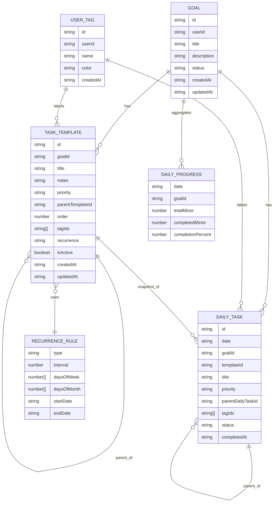

# DayForge App

Documentation — a complete description of the DayForge frontend project.

## Summary

DayForge is a frontend application for modeling and tracking goals, task templates, daily task snapshots, tags, and day progress. The project's purpose is to provide a user interface for planning major goals and their subordinate tasks, automatically generating daily snapshots from templates, and tracking day-to-day completion progress.

## User-facing purpose

- Plan and structure goals with nested task templates.
- Create recurring task templates and receive daily snapshots to act on.
- Track progress per day and per goal.
- Tag tasks, set priorities, and maintain a `major / minor` hierarchy.

## Key features

- Goal and task-template model with hierarchical support.
- Recurrence rules for templates to enable repeating tasks.
- Daily snapshot (`daily_tasks`) keeps historical records stable when templates change.
- Component-based UI built with Vue 3 and TypeScript.

## Technology stack

- Vue 3 (Single File Components)
- TypeScript
- Vite (dev server and build)
- lightningcss (present in devDependencies for CSS transforms)
- Standard web technologies: HTML, CSS

## Patterns and architectural decisions

- Composition API + Composables: component logic is extracted into `src/composables` for reuse and testability.
- Entity / Domain model: domain entities live in `src/entities` (GoalEntity, TaskEntity, RecurrenceEntity, UserTagEntity) as plain data models.
- Snapshot pattern: daily tasks (`daily_tasks`) store a copy of the template state at creation time so history remains unchanged.
- Feature-based folder structure: the UI is organized by feature under `src/features` (goals, sidebar, tasks) for clarity.
- Separation of concerns: components handle presentation, composables handle state and logic, entities define data shapes.

## Project structure (overview)

- `index.html` — root HTML template
- `src/main.ts` — application entry point
- `src/App.vue` — root Vue component
- `src/assets/` — static assets
- `src/composables/` — reusable logic (useGoals, useTaskTree, useTheme, etc.)
- `src/entities/` — domain models
- `src/features/` — feature modules and components (goals, sidebar, tasks)
- `src/pages/` — top-level views (for example, `MainPage.vue`)
- `src/styles/` — global styles

Notable composables:

- `useGoals.ts` — manages the list of goals
- `useGoalSpace.ts` — generates daily tasks from templates
- `useTaskTree.ts` — hierarchical task representation

## Data model (ERD)



## Local development

Make sure you have Node.js installed (LTS recommended) and npm available.

Scripts available in `package.json`:

- `npm run dev` — run Vite dev server
- `npm run build` — run `vue-tsc` type check and build with Vite
- `npm run preview` — preview the built bundle with Vite

Example commands:

```powershell
npm install
npm run dev
```

If you run into `npm` execution issues on Windows PowerShell, consider using `npm.cmd` or adjusting execution policies or running an elevated terminal.

## Build & production

```powershell
npm run build
npm run preview
```

## Where to find key parts of the code

- UI: `src/features/*/components` — feature components
- State logic: `src/composables/*` — composables for state and operations
- Models: `src/entities/*` — entity classes and types
- Pages: `src/pages` — main views

## Recommendations for contributors

- Use composables to share logic instead of introducing global state unnecessarily.
- Keep recurrence rules and daily task generation in isolated modules to simplify testing.
- Preserve the snapshot approach for `daily_tasks` so history is not lost when templates change.

## Testing

This repository currently has no test configuration. Adding unit tests for composables and critical utilities (for example, daily task generation and recurrence rule handling) is recommended.

## Contributing

1. Fork the repository.
2. Create a branch named `feature/your-feature`.
3. Make changes locally and add tests when possible.
4. Open a Pull Request describing the changes.

## FAQ / Troubleshooting

- If the app does not render, check the browser console for TypeScript or runtime compilation errors.
- If styles do not apply, ensure the `lightningcss` platform package from `devDependencies` matches your development environment.

---

If you want, I can add an "API contract" section with backend request/response examples, or expand the CONTRIBUTING section with Prettier/ESLint and CI setup. Would you like me to add that?
