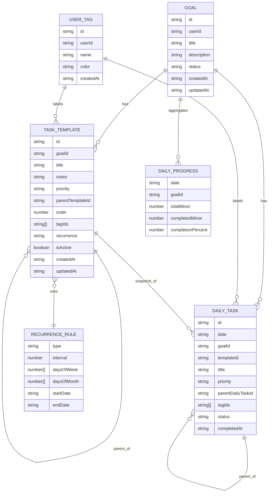

# DayForge App

This project models goals, reusable task templates, daily snapshots, tags, and day progress.

## Data Model

## Notes

- `daily_tasks` is a snapshot, so history stays stable even if templates change later.
- `parentTemplateId` and `parentDailyTaskId` preserve the major/minor hierarchy.
- `dailyProgress` can be stored as a cache or computed on demand.
